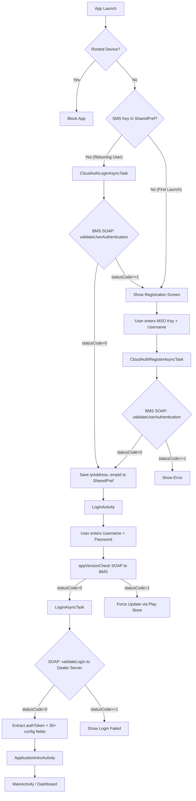

# EzyBill Authentication Flow — Complete Technical Documentation

> **Purpose**: This document is a from-scratch reference for replicating the EzyBill authentication system in Flutter. It covers every step from app launch to dashboard access.

---

## Table of Contents

1. [Architecture Overview](#1-architecture-overview)
2. [Two-Server Architecture](#2-two-server-architecture)
3. [URL Obfuscation (Decryptions)](#3-url-obfuscation)
4. [Config Properties File](#4-config-properties-file)
5. [Phase 1: Device Registration (BMS Authentication)](#5-phase-1-device-registration)
6. [Phase 2: App Version Check](#6-phase-2-app-version-check)
7. [Phase 3: User Login (SOAP)](#7-phase-3-user-login)
8. [Phase 4: Access Control (REST)](#8-phase-4-access-control)
9. [Phase 5: Post-Login Navigation](#9-phase-5-post-login-navigation)
10. [SharedPreferences Data Map](#10-sharedpreferences-data-map)
11. [Complete Flow Diagram](#11-complete-flow-diagram)
12. [Flutter Implementation Guide](#12-flutter-implementation-guide)
13. [Source File Reference](#13-source-file-reference)

---

## 1. Architecture Overview

The authentication is a **4-phase pipeline**:

```
App Launch → [Phase 1] BMS Device Auth → [Phase 2] Version Check → [Phase 3] User Login → [Phase 4] Access Control → Dashboard
```

- **Phase 1** talks to the **BMS Server** (centralized cloud) via SOAP
- **Phase 2** talks to the **BMS Server** via SOAP
- **Phase 3** talks to the **Dealer's REST Server** (returned by Phase 1) via SOAP
- **Phase 4** talks to the **Dealer's REST Server** via HTTP POST (REST/JSON)

---

## 2. Two-Server Architecture

### BMS Server (Cloud — Centralized)

- **Purpose**: Device registration, version checking, MSO key validation
- **Protocol**: SOAP (ksoap2, SOAP 1.1)
- **URL**: Obfuscated via triple hex-encoding in `EzyBillConstants.NAMESPACE_BMS`
- The decoded URL points to a PHP backend (e.g., `http://[domain]/ezybmsys/app/index.php`)

### Dealer REST Server (Per-Dealer)

- **Purpose**: User login, customer operations, payments, etc.
- **Protocol**: SOAP for login; REST (Volley HTTP POST) for access control and other operations
- **URL**: Returned dynamically by Phase 1 as `ipAddress` in the BMS response
- Stored in SharedPreferences as `login_url`
- This URL is different for each MSO/dealer

---

## 3. URL Obfuscation

The BMS server URL is obfuscated using **triple hex-encoding** in [Decryptions.java](file:///d:/Git-Repos/ezybillandroidstudio/app/src/main/java/com/itp/ezybill/androidapp/utils/Decryptions.java).

### How `decryptions1()` Works

```
Input: "74214333633383337333433373334333733303337333333...16038"
                                                              
Step 1: Strip first 5 chars and last 5 chars (padding/salt)
Step 2: Split remaining string into 2-char hex pairs
Step 3: Decode each hex pair → get another hex string (1st layer)
Step 4: Decode that hex string → get another hex string (2nd layer)  
Step 5: Decode that hex string → get the actual URL (3rd layer)
```

### For Flutter

You can either:
- **Hardcode the decoded URL** directly (simplest for internal app)
- **Replicate the triple-hex decode** using Dart's `hex` codec

> [!IMPORTANT]
> The constant `NAMESPACE_BMS` in [EzyBillConstants.java](file:///d:/Git-Repos/ezybillandroidstudio/app/src/main/java/com/itp/ezybill/androidapp/utils/EzyBillConstants.java) (line 47) holds the obfuscated BMS URL.
> The constant `NAMESPACE` (line 40) is an **empty string** — it's the namespace for the dealer server SOAP calls.

---

## 4. Config Properties File

All SOAP method names and REST endpoint paths are stored in [configg.properties](file:///d:/Git-Repos/ezybillandroidstudio/app/src/main/assets/configg.properties).

### Authentication-Related Keys

| Key | Value | Used In |
|-----|-------|---------|
| `LOGIN` | `validateLogin` | Phase 3 — SOAP method for user login |
| `valauth` | `validateAuthentication` | Phase 1 — SOAP URL suffix & action for BMS auth |
| `valuseauth` | `validateUserAuthentication` | Phase 1 (ACT flavor) — SOAP method name |
| `appvc` | `appVersionCheck` | Phase 2 — SOAP method for version check |
| `acccntrl` | `/customerRestservices/getaccesscontroll` | Phase 4 — REST endpoint for access control |

Read via [PropertyReader.java](file:///d:/Git-Repos/ezybillandroidstudio/app/src/main/java/com/itp/ezybill/androidapp/utils/PropertyReader.java) which loads from the `assets/configg.properties` file.

---

## 5. Phase 1: Device Registration (BMS Authentication)

### Entry Points

There are **two launcher activities** depending on the product flavor:

| Flavor | Launcher Activity | Behavior |
|--------|------------------|----------|
| `act` (ACT Digital LCO) | [ACT_LoginActivity](file:///d:/Git-Repos/ezybillandroidstudio/app/src/main/java/com/itp/ezybill/androidapp/activities_fragments/ACT_LoginActivity.java) | Auto-registers with hardcoded MSO key, no user input needed |
| `free` (EzyBill generic) | [CloudAuthentication](file:///d:/Git-Repos/ezybillandroidstudio/app/src/main/java/com/itp/ezybill/androidapp/activities_fragments/CloudAuthentication.java) | Requires user to enter MSO Key + Username manually |

### Security Check (Both Flavors)

Before anything, the app checks for **rooted devices** using the `RootBeer` library:
```java
rootBeer = new RootBeer(context);
if (rootBeer.isRooted() || rootBeer.detectTestKeys()) {
    // Block app, show "can't run on this device" dialog
}
```

### Step 1a: Check if Already Registered (CloudAuthLoginAsyncTask)

On launch, the app sends a SOAP request to check if this device's IMEI is already registered.

#### SOAP Request Details

| Field | Value |
|-------|-------|
| **Endpoint URL** | `{decoded_BMS_URL}/validateAuthentication` |
| **SOAP Action** | `{decoded_BMS_URL}/validateAuthentication` |
| **SOAP Method** | `validateUserAuthentication` |
| **Namespace** | `{decoded_BMS_URL}` |
| **Envelope** | SOAP 1.1 |

#### Request Payload ([Validateauth.java](file:///d:/Git-Repos/ezybillandroidstudio/app/src/main/java/com/itp/ezybill/androidapp/complexclasses/Validateauth.java))

| Field | Type | Value |
|-------|------|-------|
| `smsCode` | String | `""` (empty — just checking, not registering) |
| `imei` | String | Device IMEI/Android ID. **ACT flavor appends `"produc"`** |
| `appTypeId` | int | `2` (Bill app type) |
| `imeiValidNumber` | int | `0` (REGISTER_CODE — means "check mode") |

#### Device ID Logic
```
if (Android <= P/API 28):  IMEI = telephonyManager.getDeviceId()
else (Android 10+):        IMEI = Settings.Secure.ANDROID_ID
```

#### Response Parsing ([CloudAuthResponse.java](file:///d:/Git-Repos/ezybillandroidstudio/app/src/main/java/com/itp/ezybill/androidapp/api/CloudAuthResponse.java))

The response is a semicolon-delimited key=value string:
```
statusCode=0;statusMessage=Success;ipAddress=https://server.com/wsController;employeeId=123;appThemeColor=1;appDashboard=1;appLogoPath=https://...;enableAadhar=0
```

| Field | Type | Description |
|-------|------|-------------|
| `statusCode` | int | `0` = registered, `≥1` = not registered |
| `statusMessage` | String | Human-readable message |
| `ipAddress` | String | **The dealer's REST server URL** (critical — used for all subsequent API calls) |
| `employeeId` | String | Employee ID for this device |
| `appThemeColor` | int | Theme color code (1-5) |
| `appDashboard` | int | Dashboard layout type |
| `appLogoPath` | String | URL to the dealer's logo image |
| `enableAadhar` | int | Whether Aadhaar features are enabled |

#### Decision Logic

```
if statusCode == 0:
    → Save ipAddress, employeeId, theme, logo to SharedPreferences
    → Navigate to LoginActivity
    
if statusCode >= 1:
    → Show registration screen (SMS Key + Username fields)
    → User must enter MSO Key
```

### Step 1b: Register New Device (CloudAuthRegisterAsyncTask)

If the device is NOT registered, the user must enter their **MSO Key** and **Username**.

#### Request Payload ([validateAuthenticationInfo.java](file:///d:/Git-Repos/ezybillandroidstudio/app/src/main/java/com/itp/ezybill/androidapp/complexclasses/validateAuthenticationInfo.java))

| Field | Type | Value |
|-------|------|-------|
| `smsCode` | String | `{mso_key}{username}` concatenated (e.g., `"fish" + "general"`) |
| `imei` | String | Device IMEI (ACT flavor appends `"produc"`) |
| `appTypeId` | int | `2` |
| `imeiValidNumber` | int | `0` |

> [!NOTE]  
> For the **ACT flavor**, the MSO key is **hardcoded**: `"ACTP" + "ecd00001"` (production). No user input is needed.

#### Same SOAP endpoint, same response structure as Step 1a.

#### On Success (statusCode == 0):
- Save all data to SharedPreferences
- Show "Registration Successful" dialog
- Navigate to LoginActivity

---

## 6. Phase 2: App Version Check

Runs **before** user login. Ensures the app version is current.

### SOAP Request Details

| Field | Value |
|-------|-------|
| **Endpoint URL** | `{decoded_BMS_URL}/validateAuthentication` |
| **SOAP Action** | `{decoded_BMS_URL}/validateAuthentication` |
| **SOAP Method** | `appVersionCheck` (from `configg.properties` key `appvc`) |
| **Namespace** | `{decoded_BMS_URL}` |

### Request Payload ([AppVersionCheckRequest.java](file:///d:/Git-Repos/ezybillandroidstudio/app/src/main/java/com/itp/ezybill/androidapp/complexclasses/AppVersionCheckRequest.java))

| Field | Type | Value |
|-------|------|-------|
| `appVersionName` | String | e.g., `"3.1"` |
| `appVersionCode` | String | e.g., `"25"` |
| `appTypeId` | String | `"2"` |
| `appclientname` | String | `""` (empty) |

### Response

Same semicolon-delimited format:

| statusCode | Action |
|-----------|--------|
| `0` | Version OK → Proceed to Phase 3 (LoginAsyncTask) |
| `1` | Update required → Redirect to Play Store |
| `3` / null | Server error → Show error dialog |

---

## 7. Phase 3: User Login (SOAP)

This is the **main authentication** step. It validates the username/password against the **dealer's server**.

### SOAP Request Details

| Field | Value |
|-------|-------|
| **Endpoint URL** | `{ipAddress from Phase 1}` (stored as `LoginActivity.URL`) |
| **SOAP Action** | `{NAMESPACE}/validateLogin` — but NAMESPACE is empty, so just `/validateLogin` |
| **SOAP Method** | `validateLogin` (from `configg.properties` key `LOGIN`) |
| **Namespace** | `""` (empty string — `EzyBillConstants.NAMESPACE`) |
| **Envelope** | SOAP 1.1, `.dotNet = true`, `.implicitTypes = true` |

> [!IMPORTANT]
> The login SOAP call uses `.dotNet = true` and `.setAddAdornments(false)` — this is critical for the SOAP envelope format. The BMS calls do NOT use these flags.

### SSL Handling

If the URL starts with `https`, the app calls `SSLConection.allowAllSSL()` which **bypasses all SSL certificate validation** (accepts all certificates).

### Request Payload ([ValidateLoginInfo.java](file:///d:/Git-Repos/ezybillandroidstudio/app/src/main/java/com/itp/ezybill/androidapp/complexclasses/ValidateLoginInfo.java))

| Field | Type | Value |
|-------|------|-------|
| `UserName` | String | User-entered username |
| `PassWord` | String | User-entered password |
| `employeeId` | int | From SharedPreferences (set during Phase 1) |
| `imei` | String | Device IMEI/Android ID |

### Response Parsing ([LoginResponse.java](file:///d:/Git-Repos/ezybillandroidstudio/app/src/main/java/com/itp/ezybill/androidapp/api/LoginResponse.java))

Same semicolon-delimited format. On `statusCode == 0`, extracts **all** of the following:

| Field | Type | Stored In | Description |
|-------|------|-----------|-------------|
| `authToken` | String | `LoginActivity.authToken` | Session token for all subsequent API calls |
| `employeeId` | int | `LoginActivity.employeeId` | |
| `employeeName` | String | `LoginActivity.user` | |
| `business_name` | String | `LoginActivity.business_name` | |
| `dealerId` | int | `LoginActivity.dealerId` | |
| `userType` | String | `LoginActivity.userType` | e.g., "RESELLER", "DEALER" |
| `useCRF` | int | `LoginActivity.useCRF` | |
| `useCAF` | String | `LoginActivity.useCAF` | |
| `useLastName` | int | | |
| `useDiscount` | int | | |
| `useDataFromMasterTable` | int | | |
| `useMandatoryForHotel` | int | | |
| `useAccountNumber` | int | | |
| `employeeParentId` | String | | |
| `employeeParentType` | String | | |
| `defaultCountry` | String | | |
| `defaultState` | int | | |
| `defaultDistrict` | int | | |
| `defaultCity` | int | | |
| `deposit_amount` | double | | |
| `lco_billtype` | int | | |
| `customer_billtype` | int | | |
| `is_direct_lco` | int | | |
| `freezecustomerparamsinapp` | int | | |
| `AUTO_RECEIPT_NUMBER` | int | | |
| `allow_top_up` | int | | LCO wallet visibility |
| `show_caf_mobile_validation` | int | | OTP popup for CAF creation |
| `CURRENCY_CODE` | String | | Default `"₹"` |
| `patch_information` | String | | Version patch info |
| `recurringServiceEdit` | int | | |
| `appMenuFormat` | String | | |
| `useLcoDeposit` | int | | |
| `blockpayment` | int | | Hide make payment |
| `stb_pairing` | int | | |
| `stb_unpairing` | int | | |
| `show_mia_agreement_upload` | int | | |
| `accept_terms_condtions` | int | | |
| `agreement_details_count` | int | | |
| `access_distributor_wise` | int | | |
| `username` | String | | Display username |
| `email` | String | | |
| `lcoMobileNo` | int | | |

> [!NOTE]
> All these values are stored as **static variables** on `LoginActivity`, NOT in SharedPreferences. They persist only for the app session.

---

## 8. Phase 4: Access Control (REST)

After successful login, the app optionally fetches feature access flags via a **REST endpoint** (Volley HTTP POST). This is currently commented out in the active code path — the app navigates directly to `ApplicationIntroActivity` after login.

### Endpoint

```
POST {LoginActivity.URL minus "/wsController"}/customerRestservices/getaccesscontroll
```

### Request Body (form-encoded)

| Key | Value |
|-----|-------|
| `authtoken` | `LoginActivity.authToken` |
| `dealer_id` | `LoginActivity.dealerId` |
| `userstype` | `LoginActivity.userType` |
| `employeeParentType` | from login response |
| `employeeParentId` | from login response |

### Response (JSON)

```json
{
  "status_code": 0,
  "status_msg": "Success",
  "int_bulk_payment": 1,
  "int_payment_transaction_report_access": 0,
  "invoice_page_access": 1,
  "payment_hist_page_access": 1,
  "access_for_complaints": 1,
  "int_stb_activation": 1,
  "int_stb_deactivation": 1,
  "int_stb_reactivation": 1
}
```

---

## 9. Phase 5: Post-Login Navigation

After Phase 3 (and optionally Phase 4), the app navigates to:

```
LoginActivity → ApplicationIntroActivity → MainActivity (Dashboard)
```

[ApplicationIntroActivity](file:///d:/Git-Repos/ezybillandroidstudio/app/src/main/java/com/itp/ezybill/androidapp/activities_fragments/ApplicationIntroActivity.java) shows a one-time intro screen, then goes to `MainActivity` with `frgToLoad=0` (Dashboard fragment).

---

## 10. SharedPreferences Data Map

Stored under key `"bmsSharedPref"`:

| Key Constant | SharedPref Key | Set During | Value |
|-------------|---------------|------------|-------|
| `SMSKEY` | `"smsKey"` | Phase 1 | The MSO key used for registration |
| `BMSAUTH` | `"bmsAuth"` | Phase 1 | `true` if device is registered |
| `LOGIN_URL` | `"login_url"` | Phase 1 | Dealer server URL (the `ipAddress`) |
| `EMP_ID` | `"emp_id"` | Phase 1 | Employee ID string |
| `APP_THEME_COLOR` | `"appThemeColor"` | Phase 1 | int 1-5 |
| `APP_DASHBOARD` | `"appDashboard"` | Phase 1 | Dashboard layout type |
| `ENABLE_AADHAAR` | `"enableAadhar"` | Phase 1 | 0 or 1 |
| `APP_LOGO_PATH` | `"appLogoPath"` | Phase 1 | URL to logo image |

---

## 11. Complete Flow Diagram



---

## 12. Flutter Implementation Guide

### What You Need to Replicate

#### 1. Decode the BMS URL
Either hardcode the decoded BMS URL or implement the triple-hex-decode in Dart.

#### 2. SOAP Client
Use a Dart SOAP/XML package (e.g., `xml`, `http`) to construct SOAP 1.1 envelopes manually. There is no direct ksoap2 equivalent in Flutter, but the SOAP XML structure is straightforward.

#### 3. Phase 1 — Device Registration
```dart
// Pseudo-code
final bmsUrl = decodeBmsUrl(NAMESPACE_BMS_CONSTANT);
final soapBody = buildValidateAuthSoap(
  smsCode: '',           // empty for check
  imei: await getDeviceId(),
  appTypeId: 2,
  imeiValidNumber: 0,
);
final response = await postSoap('$bmsUrl/validateAuthentication', soapBody);
final parsed = parseCloudAuthResponse(response);
if (parsed.statusCode == 0) {
  // Save parsed.ipAddress as the dealer server URL
  // Save parsed.employeeId
  // Navigate to login
} else {
  // Show MSO key registration form
}
```

#### 4. Phase 2 — Version Check
```dart
final soapBody = buildVersionCheckSoap(
  appVersionName: '1.0.0',
  appVersionCode: '1',
  appTypeId: '2',
  appclientname: '',
);
final response = await postSoap('$bmsUrl/validateAuthentication', soapBody);
// Parse statusCode: 0 = proceed, 1 = force update
```

#### 5. Phase 3 — User Login
```dart
final dealerUrl = savedDealerUrl; // from Phase 1
final soapBody = buildLoginSoap(
  userName: username,
  passWord: password,
  employeeId: savedEmployeeId,
  imei: await getDeviceId(),
);
// NOTE: Use dotNet-style SOAP envelope
final response = await postSoap(dealerUrl, soapBody,
  soapAction: '/validateLogin',
  namespace: '',  // empty
);
final parsed = parseLoginResponse(response);
// Extract authToken, dealerId, userType, etc.
```

#### 6. Phase 4 — Access Control (REST)
```dart
final baseUrl = dealerUrl.replaceAll('/wsController', '');
final response = await http.post(
  '$baseUrl/customerRestservices/getaccesscontroll',
  body: {
    'authtoken': authToken,
    'dealer_id': dealerId.toString(),
    'userstype': userType,
    'employeeParentType': empParentType,
    'employeeParentId': empParentId,
  },
);
final json = jsonDecode(response.body);
// Parse feature flags
```

#### 7. Device ID in Flutter
```dart
// Use device_info_plus package
if (Platform.isAndroid) {
  final androidInfo = await DeviceInfoPlugin().androidInfo;
  if (androidInfo.version.sdkInt <= 28) {
    // IMEI — requires special permission, rarely granted on modern Android
  } else {
    deviceId = androidInfo.id; // Android ID
  }
}
```

#### 8. Persistent Storage
Replace SharedPreferences with Flutter's `shared_preferences` package:
```dart
final prefs = await SharedPreferences.getInstance();
await prefs.setString('login_url', ipAddress);
await prefs.setString('emp_id', employeeId);
await prefs.setBool('bmsAuth', true);
await prefs.setString('smsKey', msoKey);
```

---

## 13. Source File Reference

| File | Role |
|------|------|
| [ACT_LoginActivity.java](file:///d:/Git-Repos/ezybillandroidstudio/app/src/main/java/com/itp/ezybill/androidapp/activities_fragments/ACT_LoginActivity.java) | LAUNCHER for ACT flavor — auto BMS auth with hardcoded key |
| [CloudAuthentication.java](file:///d:/Git-Repos/ezybillandroidstudio/app/src/main/java/com/itp/ezybill/androidapp/activities_fragments/CloudAuthentication.java) | BMS auth for EzyBill flavor — manual MSO key entry |
| [LoginActivity.java](file:///d:/Git-Repos/ezybillandroidstudio/app/src/main/java/com/itp/ezybill/androidapp/activities_fragments/LoginActivity.java) | Username/password login + version check + session state holder |
| [ApplicationIntroActivity.java](file:///d:/Git-Repos/ezybillandroidstudio/app/src/main/java/com/itp/ezybill/androidapp/activities_fragments/ApplicationIntroActivity.java) | One-time intro screen, MIA agreement check |
| [EzyBillConstants.java](file:///d:/Git-Repos/ezybillandroidstudio/app/src/main/java/com/itp/ezybill/androidapp/utils/EzyBillConstants.java) | All constant keys, obfuscated BMS URL |
| [Decryptions.java](file:///d:/Git-Repos/ezybillandroidstudio/app/src/main/java/com/itp/ezybill/androidapp/utils/Decryptions.java) | Triple hex-decode for BMS URL |
| [PropertyReader.java](file:///d:/Git-Repos/ezybillandroidstudio/app/src/main/java/com/itp/ezybill/androidapp/utils/PropertyReader.java) | Reads method names from configg.properties |
| [configg.properties](file:///d:/Git-Repos/ezybillandroidstudio/app/src/main/assets/configg.properties) | All SOAP method names and REST paths |
| [Validateauth.java](file:///d:/Git-Repos/ezybillandroidstudio/app/src/main/java/com/itp/ezybill/androidapp/complexclasses/Validateauth.java) | SOAP model for BMS check (login mode) |
| [validateAuthenticationInfo.java](file:///d:/Git-Repos/ezybillandroidstudio/app/src/main/java/com/itp/ezybill/androidapp/complexclasses/validateAuthenticationInfo.java) | SOAP model for BMS registration |
| [ValidateLoginInfo.java](file:///d:/Git-Repos/ezybillandroidstudio/app/src/main/java/com/itp/ezybill/androidapp/complexclasses/ValidateLoginInfo.java) | SOAP model for user login |
| [AppVersionCheckRequest.java](file:///d:/Git-Repos/ezybillandroidstudio/app/src/main/java/com/itp/ezybill/androidapp/complexclasses/AppVersionCheckRequest.java) | SOAP model for version check |
| [CloudAuthResponse.java](file:///d:/Git-Repos/ezybillandroidstudio/app/src/main/java/com/itp/ezybill/androidapp/api/CloudAuthResponse.java) | Parser for BMS auth response |
| [LoginResponse.java](file:///d:/Git-Repos/ezybillandroidstudio/app/src/main/java/com/itp/ezybill/androidapp/api/LoginResponse.java) | Parser for login response (30+ fields) |
| [SSLConection.java](file:///d:/Git-Repos/ezybillandroidstudio/app/src/main/java/com/itp/ezybill/androidapp/activities_fragments/SSLConection.java) | Bypasses SSL cert validation for HTTPS |
| [AndroidManifest.xml](file:///d:/Git-Repos/ezybillandroidstudio/app/src/main/AndroidManifest.xml) | Activity declarations, launcher intents |
